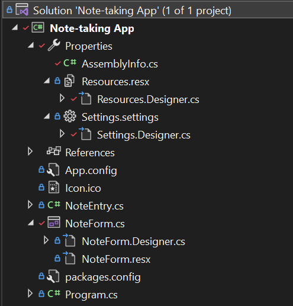

# What is this?
This is my first attempt at making a form app with C#. It is completely useless, as it does not save data once closed (hence *temporary* note-taking app), but could have some use, nevertheless.

Edit 2023: Well... that is... until 2023 :) I've gotten better and understand how C# works now lmao. I've improved the interface display (sorta went the lazy way), and made a data-saving mechanism!

Btw this was inspired by [this](https://www.youtube.com/watch?v=8vAx0kObdps) video. If the video is down, look it up on *archive.org* or ask me for a torrent ig idk.

# Usage
1. Download the latest release from the releases section.
2. Run the executable.
3. Type in your note.
4. Click the save button.
5. Close the app.
6. Reopen the app.
7. Woah your previous note just appeared again 😶 so click read to read it.

:) kek I mean it is pretty self explanatory so whatever lmao  
Ok on a more serious note, let's talk about how the app's specifics work.

# Project Structure
At the root of the project is the solution, gitattributes, and gitignore. These are automatically generated by Visual Studio when making a project, and the gitignore specifies for git to ignore downloaded libraries/dependencies (ie NuGet packages) as well as compiled binaries for debugging and releases amongst other things. You may open and compile the project from the solution using VS.  

All NuGet packages are stored in the `/packages/` folder from root. This is also automatically generated/restored by VS, and is usually in the gitignore to not bloat up the repository. However, I've decided to include it for convenience.

The folder with the same name as the solution file, in this case, `/Note-taking App/`, is the project folder. This is where all the actual C# source code is stored. Inside, two folders `/bin/` and `/obj/` should appear and contain compiled binaries when you use VS to compile the project, and hence are in the gitignore. Then, there is the `/Properties/` folder which is used to store metadata such as project-specific configuration files and settings that otherwise define assembly-level attributes about the project. You don't need to directly edit any of the files here unless you're doing something weird, since typically VS already sets up and handles everything for you (and you edit minor things like naming via a GUI).

Lastly, littered within `/Note-taking App/` is the rest of the source code. It may seem unorganized in a file explorer, but the solution file details its organization so you have to open the project in VS to be able to properly edit it. Note that the csproj file inside this folder is part of the solution file, and contains some xml spam which details how the project is organized. Anyhow, once you open the solution, go to the Solution Explorer tab and you should see something similar to this   
  
The `Properties` dropdown contain all the stuff mentioned in the previous paragraph. The `References` dropdown meanwhile details all the project dependencies, such as default system dependencies and NuGet packages.

Next, we have two configuration files. To wit, `App.config`, specifying runtime settings for the project, and `packages.config`, specifying the NuGet packages used in the project. Again, you don't need to edit these files directly, since VS handles them for you.

Lastly, we get to the important part where you actually would want to make edits if you want to change the app in some way. First, we have `Program.cs`, which is the file that is actually running when you compile and open the executable, as it contains the `Main()` method, which is the entry point of the program. In there, we simply detail some threading settings and make a new instance of the NoteForm class, amongst other things.

The NoteForm class is located in the `NoteForm.cs` dropdown, which additionaly is bundled with its respective Designer and resx resource files. When you open this, instead of code, VS renders a GUI editor. You can either manually drag around things to position them and edit the properties in the `Properties` tab, or go to the Designer file `NoteForm.Designer.cs` to edit the code. The Designer file is automatically generated by VS when you make changes to the GUI via the GUI editor, and you can manually edit it as well to make additional changes such as with scaling. In the original app, there was no scaling, and I literally tried for hours to get a working responsive scaling system, but to no avail. So I just gave up and kinda cheated by disabling scaling on the whole, and just anchoring a bunch of elements and only allowing the maximize and minimize buttons to do anything remotely similar to scaling lmao. The resx resource file just details all the resources used by the form such as the icon so don't bother editing it. It's all unintelligible xml spam anyway.

Lastly, we have the `NoteForm.cs` file, which contains the code responsible in making the form, well, responsive. It is accessed by double clicking the GUI editor. First, we instantiate a data table element and a list of `NoteEntry` elements (for the json storage, defined in `NoteEntry.cs`). The constructor initializes the window with `InitializeComponent()`, disables scaling, and opens a `FormClosing` event handler. Then, once the form is loaded, we set up the data table, and load any existing data from the json file. Then, we define what happens when each of the buttons are pressed. When the form is closed, it exports all the existing notes back into the json file. It's really not that complicated, and the data storage system is pretty rudimentary. 

# Dependencies
This program needs a dotNET Framework of at least v4.7.2, a Winforms desktop development SDK (it should be present be default on a VS installation, but if not, you can add it manually from the installer), and the Newtonsoft Json v13.0.3 package for storage.  

I've decided to include the packages folder with the repo, so the NuGet dependencies should come with the repo. This means you shouldn't need a `dotnet restore` to get them back.

# Compiling
Just switch your build configuration to whatever mode you need it to be (Debug or Release), and build the solution. This should generate your executable in the `/bin/<mode>/` folder. Interestingly enough, VS shoves a bunch of debugging stuff into the Release build as well (there is literally no difference between debug and release to VS for this project lmao bruh). The only files needed to run the program is the executable itself, its exe.config file, and the NuGet package dlls, so you technically can delete everything else if you're just distributing the program. If you're trying to debug, keep everything because it will be useful for analysis.

# Name 🤔
Not so much of a "*temporary* note-taking app" now are we? lmao  
Time to change the repo name and update releases/descripton/readme whatever :)

Have fun with this useless project. 😃
